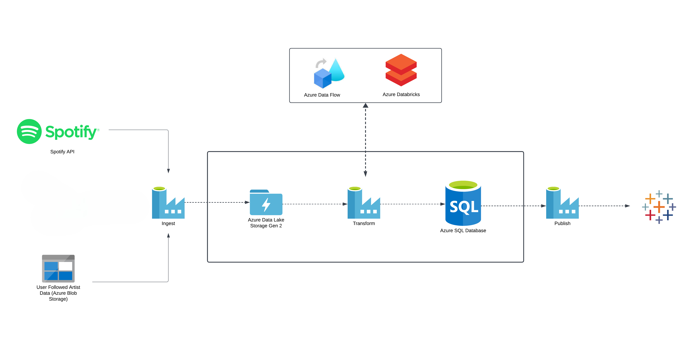
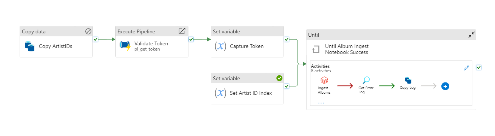
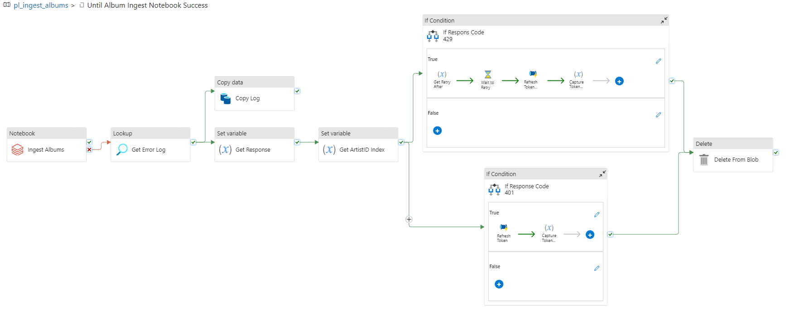
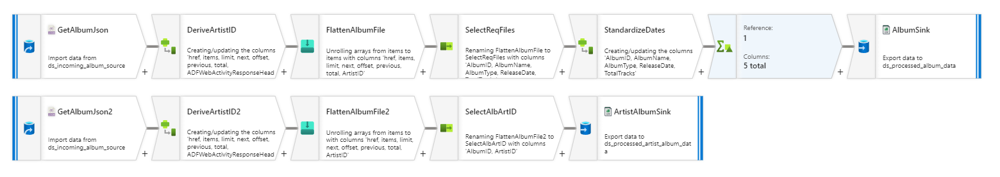
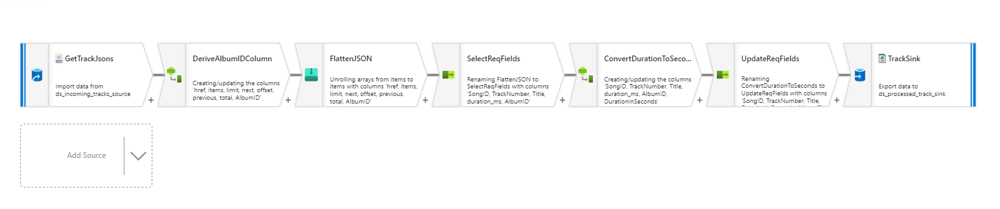
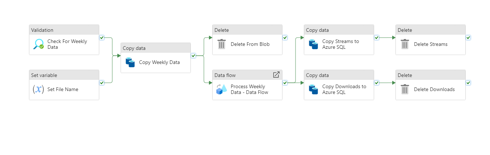

# ETL Pipeline for Music Database

## Purpose

This project focuses on building a scalable music database for real time analysis by applying foundational data engineering principles. Using a robust ETL pipeline and tools like Azure Data Factory and Databricks, it automates data processing. The project on practical application of industry-standard technologies, laying the groundwork for advanced analytics and future enhancements


## Scope and Goals

The project encompasses the end-to-end development of a music database, including:
 Extracting data from Spotify's API, such as artist discographies, albums, genres, and followers.
 Transforming and organizing the data for seamless integration into a scalable database.
 Leveraging Microsoft Azure to optimize performance, scalability, and automation.
 Building a reusable ETL pipeline to reinforce knowledge in data engineering processes.
Establish a process-oriented baseline for handling music data from Spotify's API which further can be scaled up for real time streaming data.


## Tools and Technologies Used

### A. List of Technologies
- **Azure Data Factory:** For orchestrating workflows
- **Azure Dataflows:** For efficient data transformations
- **Azure Databricks:** For advanced processing capabilities
- **Azure SQL:** For detailed analysis, utilizing Azure's relational database service
- **Python scripting:** For specific functionalities

### B. Justification for Selecting Each Tool

Our decision to exclusively utilize Azure services stems from the fact that Azure offers Azure Data Factory for seamless ETL with built-in connectors, while AWS relies on Glue, which has a steeper learning curve. Azure’s SQL Database is cost-effective for small projects as it provides a serverless setup option under free tier, whereas AWS’s RDS can be more expensive for similar usage. Additionally, Azure provides better integration with Databricks for scalable processing and offers $200 in free credits for new users, making it more beginner-friendly than AWS.


## Architecture Diagram



The architecture diagram illustrates the flow and integration of various components in the ETL pipeline.

## ER Diagram


The ER diagram showcases the relationships between different entities in the music database schema.

Before running the ETL pipeline, make sure you have the necessary dependencies installed. You can install them using the following commands:

```bash
pip install spotipy  # Python library for Spotify API
```
## Data Extraction

### Source of Data

Data is sourced from Spotify's API and a custom Python script generating fictional values for song streams and downloads.

Data Extraction Code

#### User-Followed Artist Data

```python
import spotipy
from spotipy.oauth2 import SpotifyOAuth
import json

def fetch_and_save_followed_artists(client_id, client_secret, redirect_uri, scope):
    sp = spotipy.Spotify(auth_manager=SpotifyOAuth(
        client_id=client_id,
        client_secret=client_secret,
        redirect_uri=redirect_uri,
        scope=scope
    ))

    all_artists = sp.current_user_followed_artists(limit=20, after=None)

    with open('followed_artists_list.json', 'a', encoding='utf-8') as file:
        artist_info = all_artists['artists']
        json.dump(artist_info, file, ensure_ascii=False)
        file.write('\n')

def main():
    # Replace <your_client_id>, <your_client_secret>, <your_redirect_uri> with your actual Spotify application credentials
    client_id = "<your_client_id>"
    client_secret = "<your_client_secret>"
    redirect_uri = "<your_redirect_uri>"
    scope = "user-follow-read"

    fetch_and_save_followed_artists(client_id, client_secret, redirect_uri, scope)
    print("Done")

if __name__ == "__main__":
    main()
```

#### Albums and Tracks

The Albums and Tracks data extracts occurs similarly. 



#### 1. Copy ArtistIDs

- Extracts ArtistIDs from a SQL database and stores them in a delimited text file on Azure Blob Storage.

#### 2. Validate Token

- Executes a pipeline ("pl_get_token") to validate and obtain an authentication token.

#### 3. Capture Token

- Captures the authentication token obtained from the "Validate Token" step.

#### 4. Set Artist ID Index

- Sets the initial artist ID index to 0.

#### 5. Until Album Ingest Notebook Success

- Loops until the Databricks notebook ("Ingest Albums") successfully runs.
- The notebook is parameterized with the captured token and artist ID index.



#### 5. Ingest Albums

- Executes a Databricks notebook to ingest albums data, using the captured token and artist ID index.

#### 6. Get Error Log

- Retrieves error information if the "Ingest Albums" step fails.

#### 7. Copy Log

- Copies error logs to another dataset for further analysis.

#### 8. Delete From Blob

- Deletes data from the original error log storage if specific conditions are met.

#### 9. Get Response

- Retrieves the response code from the error log.

#### 10. Get ArtistID Index

- Retrieves the current artist ID index from the error log.

#### 11. If Response Code 429

- Checks if the response code indicates a rate limit exceeded.
- If true, waits for a specified time, refreshes the token, and updates variables accordingly.

#### 12. If Response Code 401

- Checks if the response code indicates unauthorized access.
- If true, refreshes the token.


## Data Transformation

### Album Data

We systematically transformed Spotify followed artist data by processing individual artists, handling associated genres, and establishing relationships between artists and genres. I utilized Spark for efficient large-scale data processing and incorporated runtime measurements to assess the processing times for different stages.

#### Sample Script:

```python
for line in lines:
    # Load JSON data from the line
    all_artists = json.loads(line)

    # Iterate over each artist in the loaded data
    for artist in all_artists['items']:
        artist_count += 1
        
        artist_name = artist['name']
        artist_id = artist['id']
        artist_followers = int(artist['followers']['total'])
        # Create a Spark DataFrame Row
        artist_row = Row(ArtistID=artist_id, Name=artist_name, Followers=artist_followers)

        # Append the Row to the artist DataFrame
        df_artist = df_artist.union(spark.createDataFrame([artist_row], schema=artist_schema))
        # Extract artist genres
        artist_genre = artist['genres']
        #unique_genres.update(artist_genre)
        print(f"{artist_count}:{artist_name}")
        
        # Process genres using Spark operations
        for genre_name in artist_genre:
            genre_data.append(genre_name)      
    
    
    print('-----------------------------------------------------------------------')

# Convert genre_data to a set to get distinct values
distinct_genre_data = set(genre_data)
# Create a mapping of genre names to GenreID
genre_id_mapping = {genre: i + 1 for i, genre in enumerate(distinct_genre_data)}
# Create a list of Row objects for the DataFrame
genre_rows = [Row(GenreID=genre_id, Name=genre) for genre, genre_id in genre_id_mapping.items()]
# Add the rows to the existing df_genre DataFrame
df_genre = df_genre.union(spark.createDataFrame(genre_rows, schema=genre_schema))

# Record the end time
main_end_time = time.time()
# Calculate the total runtime
total_run_time = main_end_time - main_start_time

# Convert the elapsed time to minutes and seconds
minutes, seconds = divmod(total_run_time, 60)
# Print the runtime
print(f"Total runtime: {int(minutes)} minutes and {round(seconds, 2)} seconds")


```


### Album Data



##### 1. Source Data Extraction (Two Instances):

- Extract data from a source with a specific structure, described by the schema.
- The source data includes information about albums, with various attributes like album type, artists, release date, etc.

##### 2. Derive Artist ID:

- Use a regular expression to extract the artist ID from the source data's 'href' field.
- This is done for both instances of source data.

##### 3. Flatten and Select Relevant Columns (Two Instances):

- Flatten the data structure to make it more suitable for further processing.
- Select specific columns like AlbumID, AlbumName, AlbumType, ReleaseDate, and TotalTracks.
- This is done for both instances of source data.

##### 4. Standardize Dates:

- Check the length of the 'ReleaseDate' field. If it's four characters, assume it's a year and standardize it to '01/01/{year}'.
- This is done to ensure a consistent date format.

##### 5. Aggregate Distinct Rows:

- Group data by 'AlbumID'.
- For each group, keep the first row as distinct, discarding duplicates.

##### 6. Sink Data (Two Instances):

- Load the processed data into two separate sinks (destination systems).
- The 'AlbumSink' receives data from the 'SelectReqFiles' transformation.
- The 'ArtistAlbumSink' receives data from the 'SelectAlbArtID' transformation.


### Track Data



#### 1.	Source Data Extraction:

- Extract data from a source named "GetTrackJsons" with a specific schema, including fields like 'href', 'items', 'limit', 'next', 'offset', 'previous', and 'total'.
- Allow schema drift and disable schema validation.

#### 2. Derive Album ID:

- Use a regular expression to extract the album ID from the 'href' field.
- Name this derived column as 'AlbumID'.
- This operation is performed using the 'DeriveAlbumIDColumn' transformation.

#### 3. Flatten and Select Relevant Columns:

- Flatten the data structure to make it more suitable for further processing.
- Select specific columns like 'SongID', 'TrackNumber', 'Title', 'duration_ms', and 'AlbumID'.
- This is done using the 'FlattenJSON' and 'SelectReqFields' transformations.

#### 4. Convert Duration to Seconds:

- Derive a new column named 'DurationInSeconds' by converting 'duration_ms' to seconds.
- Use the 'ConvertDurationToSeconds' transformation for this operation.

#### 5. Update Required Fields:

- Select and rename columns to match the final desired structure.
- Columns include 'SongID', 'TrackNumber', 'Title', 'DurationInSeconds', and 'AlbumID'.
- This is achieved using the 'UpdateReqFields' transformation.

#### 6. Sink Processed Data:

- Load the processed data into a sink named "TrackSink," which is associated with a dataset reference named "ds_processed_track_sink."
- Allow schema drift, disable schema validation, and specify umask, preCommands, and postCommands configurations for the sink operation.

#### 1. Source Data Extraction (Two Instances):

- Extract data from two sources named "GetWeeklyJSON" and "GetWeeklyJSON2," both associated with the same dataset reference named "ds_weekly_data_raw."
- The source data includes information about songs, with attributes like 'song_id' and 'weekly_data.'

#### 2. Flatten and Select Relevant Columns (Two Instances):

- For the first instance:
  - Flatten the nested structure of 'weekly_data' to make it more suitable for further processing.
  - Select specific columns like 'WeekID,' 'SongID,' 'WeekStartDate,' 'WeekEndDate,' and 'WeeklyStreams.'

- For the second instance:
  - Flatten the nested structure of 'weekly_data' again.
  - Select specific columns like 'WeekID,' 'SongID,' 'WeekStartDate,' 'WeekEndDate,' and 'TotalWeeklyDownloads.'

#### 3. Sink Processed Data (Two Instances):

- Load the processed data into two separate sinks.
  - The "StreamSink" receives data from the first instance's transformation.
  - The "DownloadSink" receives data from the second instance's transformation.

## Workflow Automation

The pipeline operates on a triggers, adding a layer of automation to the overall process. The trigger initiates the creation of the database when the file containing followed artists' data is placed into Blob Storage. 

``` bash
{
    "name": "tr_followed_artist_data_arrived",
    "properties": {
        "description": "The \"tr_followed_artist_data_arrived\" trigger is a Blob Events Trigger that triggers the \"pl_execute_all\" pipeline when new blobs are created in the \"/followed-artist-data/blobs/followed_artists_list.json\" path within the specified Azure Storage account.",
        "annotations": [],
        "runtimeState": "Started",
        "pipelines": [
            {
                "pipelineReference": {
                    "referenceName": "pl_execute_all",
                    "type": "PipelineReference"
                }
            }
        ],
        "type": "BlobEventsTrigger",
        "typeProperties": {
            "blobPathBeginsWith": "/followed-artist-data/blobs/followed_artists_list.json",
            "ignoreEmptyBlobs": true,
            "scope": "<your_subscription>",
            "events": [
                "Microsoft.Storage.BlobCreated"
            ]
        }
    }
}
```

## Weekly Data ETL

After the database is created we put together the weekly streams and downloads etl pipeline. This is to be ran each sunday when new simulated weekly data is genereated into blob storage.



To Generate weekly data wet wrote a Python script that defines a function called generate_weekly_data. This function generates simulated weekly download and stream data for a provided list of songs. To accomplish this, we used the datetime, timedelta, numpy (as np), and json modules. For each of the 52 weeks in a year, the script randomly generates mean and standard deviation values for downloads and streams for each song. Then, it generates random numbers following a normal distribution based on these parameters.

The script formats the data, including the week number, start and end dates, total weekly downloads, and total weekly streams. It saves this information for each song in separate JSON files, with one file for each week. I've also included two auxiliary functions: get_week_dates, which determines the start and end dates of a given week, and write_to_file, which writes data to JSON files.

We adopted this approach because Spotify does not provide streaming and download numbers for individual songs on their platform. They only offer aggregate data for an artist's top 5 songs. This script serves as a workaround to simulate and generate the desired data.

**Sample Code:**

```python
def generate_weekly_data(song_list):
    # Get the current year and week
    current_year, _, _ = datetime.now().isocalendar()

    for week_number in range(1, 53):
        weekly_data = {"songs": []}

        for song in song_list:
            # Generate random mean and standard deviation for downloads and streams
            downloads_mean = np.random.uniform(30000, 70000)
            downloads_std = np.random.uniform(10000, 30000)

            streams_mean = np.random.uniform(400000, 800000)
            streams_std = np.random.uniform(150000, 300000)

            # Generate random numbers for downloads and streams using a normal distribution
            total_weekly_downloads = int(np.random.normal(downloads_mean, downloads_std))
            total_weekly_streams = int(np.random.normal(streams_mean, streams_std))

            # Ensure the generated numbers are non-negative
            total_weekly_downloads = max(total_weekly_downloads, 0)
            total_weekly_streams = max(total_weekly_streams, 0)

            # Get the start and end dates of the week
            start_date, end_date = get_week_dates(current_year, week_number)

            # Append the data to the weekly_data list
            song_data = {
                "song_id": song,
                "weekly_data": {
                    "week": week_number,
                    "week_start_date": start_date.strftime('%Y-%m-%d'),
                    "week_end_date": end_date.strftime('%Y-%m-%d'),
                    "total_weekly_downloads": total_weekly_downloads,
                    "total_weekly_streams": total_weekly_streams
                }
            }

            weekly_data["songs"].append(song_data)

        # Save data for each week separately
        write_to_file(weekly_data, f'weekly_data_week_{week_number}.json')
```

```python
# Rest of your code remains unchanged
def get_week_dates(year, week_number):
    start_date = datetime(year, 1, 1)
    start_of_week = start_date + timedelta(days=(week_number - 1) * 7 - start_date.weekday())
    end_of_week = start_of_week + timedelta(days=6)
    return start_of_week, end_of_week

def write_to_file(data, file_name):
    with open(file_name, 'w') as file:
        json.dump(data, file, indent=2)
```


## Challenges Faced

Challenge 1: Spotify API Authentication
Problem: Initial attempts to use OAuth for user-followed artist data extraction were unsuccessful.
Solution: Implemented a local extraction process using the Spotipy library to authenticate requests and transfer data to Azure Blob Storage.
Challenge 2: Efficient Data Ingestion
Problem: Initial approach using Data Factory's web activities was inefficient for large-scale data ingestion.
Solution: Leveraged Azure Databricks for scalable data processing and implemented a Retry-After solution to handle Spotify's API rate limits.
Challenge 3: Steep Learning Curve
Problem: Lack of prior experience with Databricks, Azure Data Factory, and OAuth.
Solution: Dedicated learning and hands-on practice.

## Conclusion

The project has established a process-oriented baseline for handling music data from Spotify's API. It demonstrates the extraction, ingestion, transformation, and loading of data using Azure services, with the data being stored in Azure SQL for analysis. While this pipeline is currently batch-oriented due to resource limitations, it provides a strong foundation that can be scaled for real-time big data management with the proper resources. The existing architecture can be easily adapted to handle real-time data processing, making it a flexible and scalable solution for future growth.


## Resources

- [Spotify for Developers](https://developer.spotify.com/documentation/web-api)
- [Azure Data Factory Documentation](https://learn.microsoft.com/en-us/azure/data-factory/)
- [How to Use Spotify's API with Python](https://www.youtube.com/watch?v=WAmEZBEeNmg&t=567s)
- [How to Mount Azure Storage to Databricks](https://techcommunity.microsoft.com/t5/azure-paas-blog/mount-adls-gen2-or-blob-storage-in-azure-databricks/ba-p/3802926) or [Azure Databricks Documentation](https://learn.microsoft.com/en-us/azure/databricks/dbfs/mounts)
- [Spotipy Python Library](https://spotipy.readthedocs.io/en/2.22.1/#)